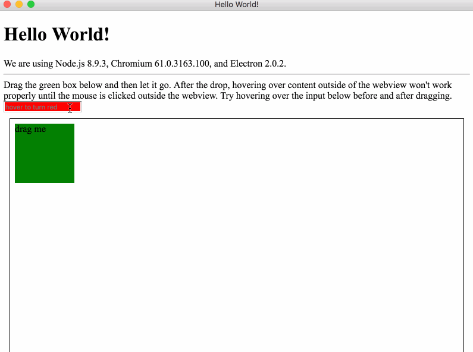

# Forked from the electron-quick-start

```
npm install
npm start
```

Drag the green box below and then let it go. After the drop, 
hovering over content outside of the webview won't work properly 
until the mouse is clicked outside the webview. Try hovering over the
input below before and after dragging.

